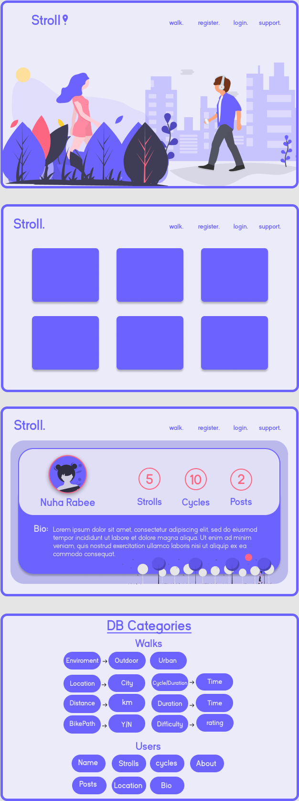

# [Stroll](https://stroll-app.herokuapp.com/)

The web app that allows users to share their favourite walking routes all over the world! The concept of this app came about to help people find a new way to stay active, aswell as to keep healthy and mentally sound throughout the COVID crisis. With more and more people finding themselves in isolation and lockdowns becoming increasingly frequent, The idea of a site that would allow users to share information about one of the world's most common passtimes could foster the idea of both community and healthy mental practice whilst keeping people engaged throughout a global pandemic. 

# UX

## An Overview of : The Why?

This project came from a very personal place. As a foreign national living overseas and now in my 10th year abroad. It is safe to say that I have had my fair share of experience, away from both home and family. But after making my way through two national lockdowns and facing a third, I knew I wanted to make a web application, that was both intuitive and culturally relevant, something that ultimately could be of help not just to me personally but more importantly others like me. In other words I wanted to fullfill a genuine need. It got me thinking of the things that we are missing as a society in this post COVID-era day to day and one of which that most stood out to me was the absence of being able to take a walk down the street, to the park, round the corner and feel as though you were surrounded by humanity. So I set out to bring that feeling of community in the everyday 15-20 min walk back to our users and just like that I decided to make Stroll. 

The idea was to make something that felt simple enough to not require much explanation to the user, something highly performant, that felt smooth, with modern visuals akin to that of an everyday mobile application with elements borrowed from recognisable social media applications like pinterest, imgur and instagram.


## User Goals:

The site's original intent was to offer an appeal to trekkers and lovers of walking all over and allow them to share their walking routes and journies with one another and maybe as the community scales in size to even discover new and unkown routes in their local areas. To help them make friends and foster a community despite self-isolation.

## The User Stories/Expectations:

As a User of the site I want to be able to:

### Navigate The landing page:
-------------------------------------------------
- Have an understanding of the site's purpose from the get go. To make use of the landing page - to recognise the interactive hero images as buttons and be able to read through the brief overview on the page on any device, mobile & dsktop.

### Use the site's navigation and search functionality:
---------------------------------

- To use the site's navigation bar on both desktop and mobile devices, in order to go from one page of the site to another and to be able to navigate backwards as well if necessary.
- To intuitively use the logo as an alternate home button.
- To identify the hamburger button as a stardard for a mobile drop down menu.
- be able to re-size the navigation bar and have it respond accordingly
- To have clearly visible links that make direction easily identifiable.
- To have the navbar available on scroll as well as have change in color so as to be able to disinguish the navbar from available content in the viewport window.
- to be able to search from any webpage available.
- To have the nav bar display the appropriate links once the user has logged in or out. 


### Interact with the Walks page:
-------------------------------------------------
#### Before sign in.
- To be able to view all walks without sign up and gain fullfillment straight away by engaging with the site's main feature - to then be enticed to join the community and become an active member.
- To be able to interact with the individual walk cards - to use the expand button in order to activate the map feature as well as read user written descriptions and further details around distance/duration and difficulty of each individual walk. 
- To engage with the interactive map, Zoom in and out and further explore the walk listed and its surrounding landmarks - to make use of gooogle api's street view and to select both point A and B to see the location adresses.
- to find the comment section by pressing upon the speech bubble icon - which is a universally identifiable icon to indicate possible comments or user anecdotes.
- to be barred from adding or commenting and actively engaging with the community unless they Create an account.

#### After sign in: 
- To be able to view the walks they have added amongst the list of all walks - to be able to search and view all walks based by category, environment and location and to make full use of the autocomplete function to have an indication of what to search for. 
- To be allowed full comment functionality and be able to share insight and interact with the community at large.

##### Interact between the Registration and Login Forms:
- To use the website's forms to register a user account as well as sign in to a pre-exsiting account if requested.
- To use the links provided at the bottom if the wrong form is selected by accident to navigate to the desired form.
- To expect the forms to be in a standard format already familiar to thee user - with a recognisable order of information to be submitted taking care that email is shown first on the registration form for example.

#### Profile
--------------------
- To be able to view a personal user profile. 
- To have that profile be fully editable. 
- To be able to add a personal biography.
- To be able to add a profile picture.
- To be able to add to and keep track of their personal stats.
- To have their number of posts update automatically once a post is made.
- To be able to select and view their personal walks, 
- To then be able to Edit or Delete those walks should they want to update the content.

#### New Walk
----------------------
- To use the Multi-Step form to be able to create a new walk
- To have a clear sense progress as they move through the form and find the experience both engaging and satisfying, every step of the way
- To able to view the form dynamically on all devices.
- To have clear understanding as what to put in under each form input
- To be guided by the site to ensure that they do not leave any input unfilled.

#### further site functionality:

- To be able to log in/out of the site
- To have the site return acknowledgement of the user's commands in the form of flash messages interactive to the user.


## Site Owner Goal

As The site's owner I too am also a user who shares an equal passion for walking and a desire to keep fit both physically and mentally throughout lockdown. My goal is true to the mission statement of the application to grow a community of people and to incentivise them to make use of my application and to foster engagment from my users by planning future upgrades to the site's facilities.

Below are the main questions I asked myself throughout the development process:

- Is this obvious to the user? - specifically when dealing with the overal interactivity of the site and presentation of information,
  I.E. how easy is it to get from A to B? are the visual and navigational choices delightful? Does the site react in a way that is intuative to the user? Does it relate to/re-create a real life model or experience?
  more specifically - can I as a user recgonise where I am, how I got here and what options I have presented to me here on out?
- Is it pretty? - Does the overall UI look inviting? is there an obvious theme or color scheme? Is it attractive to my users, do they engage with the pictures and images used?
  Is the information displayed in a spaced out fashion? Is it distinguishible from other pieces of information? Is it pleasurable to the eye? Can it be retained at a glance? Will I need to remember where to go the next time I visit? 
- Is it interactive? - Does the site offer  visual queues to the user? Are the responses timely? Do they add to the understanding of the user? Do they add to the interactivity of the user and add weight to the users choices? Is the generation of each individual map performant in nature? Are their points where the site is susceptible to lag or inefficancy?
- Is it purposeful? - Am I building something enjoyable? Does it offer incentive to return? Is it a pleasure to use? Is it convenient?  Have I built the site in a way that helps the user fullfill the desired need?

# Design 

I wanted to go for a thematic approach that favoured illustrations over images I used the website <a href= "https://undraw.co/illustrations">Undraw</a> to accomplish this. The overall idea was to create an application with distinctively modern/minimalistic visuals with smooth egdes in favour of hard sharp corners, akin to that of an everyday mobile application with elements borrowed from recognisable social media applications like pinterest, imgur and instagram. 

## color scheme

The color scheme was also picked purposefully in order to evoke a calming effect on the user, which is why all secondary and tertiary colors tended to be shades of the same mother color along with complimentary accents for buttons and highlighted features. With the exception of the flashed messages which make use of a deep red in case of error messages as well as the edit and delete buttons which were given the colors of green and red respectively.


   `#6c64ff`  (**Blue/purple** - *primary color*)<br />
   `#6c64ff`  (**light/purple/grey** - *background color*)<br />
   `#6c64ff`  (**light/purple/grey** - *Tertiary color*)<br />

## Icons
----------

- Font Awesome 5.8.1 (https://fontawesome.com/)
    - I prefer the look of Font Awesome's icons, and they have more to suit my specific needs for this project. They aren't displayed using *text*, but rather *classes*, so use on mobile devices isn't affected.

## Typography
---------------
As Always the font choice needed to be specific. I wanted the font to feel both light and playful yet also modern, I was really excited when I stumbled upon the Kayak font family. It instantly felt very unique and fit in very well overall in this project, the font is available for download in the assets folder of this project. It is also deployed locally as google fonts don't seem to have it freely available.


## Wireframes

For this project I used <a href= "https://www.figma.com/">figma</a> as a free online tool to complete my wireframes. Its Easy to use navigation had me creating high fidelity wireframes and concepts within minutes. As I was using Undraw for the illustrations of this site the stylistic choices for the website came very naturally. 

You can find all my wireframes here including the original concepts of what was to be included in my walks collection.



# features

## Features

I've added a few extra features to my project that weren't part of the requirements, because I felt they made the project 'complete' for better user interaction.

### Existing Features

**Register Account**
- Anybody can register for free and create their own unique account. I have built-in authentication and authorization to check certain criteria is met before an account is validated. All passwords are hashed for security purposes!

**Log In to Account**
- For existing users, I have more authentication and authorization incorporated to check that the hashed passwords and username match the database.

**Edit_Profile**
- Users are allowed to fully edit their profile as personal record eventually functionality will be added so that users can share their profiles amongst one another.
- The posts entry also automatically updates on refresh according to the amount of posts made by the user. 

**Comment section**
- users are also able to comment under their preferred walks. Another use of defensive programming is used here which disables the comment input if the user is not signed in. 

**Log Out of Account**
- Users can easily log out of their account with the click of a button.

**View all Walks**
- On the *walks* page, all user inputted strolls are displayed and fully interactive 

**Search Walks**
- If a user would like to search for something specific, whether it's a particular walk, a certain environment, or for locations and cities, then the Search button is perfect!

**Autocomplete**
- I have an in built autocomplete function that uses injected information from the database, If the user inputs a new location or city for example this will be added to the autocomplete array

**Interactive Google-Map api**
- Using Googles directions api I have been able to add dynamic directions rendered once users provide the start and end co-ordinated when adding walk, I have used an onclick function to render each map individually with {{loop.index}} to create unique numbered id's. This allows the site to be more performant as each map only renders when the onclick event is triggered.

**full image hosting**
- With the use of the Cloudinary api all images are hosted and users are able to upload their own images rather than relying on some sort of url.

**Add a Walk**
- [**C**RUD] Create or 'add' a new Walk. Through the use of my very own multistep form with built in progressbar to  provide the user with feedback as they navigate the form for an overall interactive and engaging UX Defensive programming in place means users must adhere to minimal requirements when adding a new Walk.

**View a Walk**
- [C**R**UD] Read or 'review' walks, either from the main page, or the user profile. From here, users also have additional options.

**Edit a Walk**
- [CR**U**D] Update or 'edit' their own user Walks on this page accesible through the my walks button found on their profile which is the first page users are re-directed to on login. This is also accomplished using the same multistep form design with progress bar. 

**Delete a Walk**
- [CRU**D**] Delete or 'remove' a user's own Walk. From the my walks page accessible through their user profile.

### Features Left to Implement

**Pagination**
- A feature that would help improve scalability and compactness of design, It is a shame that I haven't been able to add this as of yet before meeting my deadline however, It will certainly be the next feature implemented.
**Edit/Delete Comments**
- A follow up feature so that users comments arent set in stone! This will increase interactivity and allow for full comment functionality
**Favourite**
The button is there I am yet to build the functionality to allow users to favourite a walk and add it to a seperate list of favourites.
**Admin User**
- The creation of an admin user will allow me to monitor the site more closely and ensure the website isnt used nefariously
**Delete Profile**
- Just a function to allow a user to leave the community if they wish
**Interactive Map for adding and editing coordinates**
- This is the feature that I am most eager to add as the current UX which has users inputting co-ordinates is contrary to the otherwise sleek experience of the app. 

## Technologies Used

- [GitPod](https://gitpod.io/) - Used as my primary IDE for coding.
- [GitHub](https://github.com/) - Used as remote storage of my code online.
- [Figma](https://www.figma.com/) - Used for editing images and to Make wireframes.

### Front-End Technologies

- [HTML](https://developer.mozilla.org/en-US/docs/Web/Guide/HTML/HTML5) - Used as the base for markup text.
- [CSS](https://developer.mozilla.org/en-US/docs/Web/CSS/CSS3) - Used as the base for cascading styles along with Many media queries written to create responsivity amongst elements that were relatively positioned.
- [jQuery 3.4.0](https://code.jquery.com/jquery/) - Used as the primary JavaScript functionality.
- [jQuery-ui ](https://code.jquery.com/jquery/) - used for the autocomplete function.
- [Bootstrap](https://getbootstrap.com/) - Used as the overall design framework.
- [GoogleMaps Api](https://cloud.google.com/maps-platform/): Used for Admin rendering all maps and the processing of Geospatial data
- [NPM](https://www.npmjs.com/): Used to install package Json node_modules for cloudinary
- [Cloudinary](https://cloudinary.com/): Used to host all images uploaded to the site.


### Back-End Technologies

- **Flask**
    - [Flask](http://flask.pocoo.org/) - Used as a microframework.
    - [Flask Blueprints](http://flask.pocoo.org/docs/1.0/blueprints/) - Used to split the python code for routes.
    - [Flask Talisman](https://github.com/GoogleCloudPlatform/flask-talisman) - Used for security headers (HTTPS vs HTTP).
    - [Jinja 2.10](http://jinja.pocoo.org/docs/2.10/) - Used for templating with Flask.
    - [Werkzeug 0.16](https://werkzeug.palletsprojects.com/en/0.16.x/) - Used for password hashing, authentication, and authorization.
- **Heroku**
    - [Heroku](https://www.heroku.com) - Used for app hosting.
- **Python**    
    - [Python 3.6.7](https://www.python.org/) - Used as the back-end programming language.
    - [MongoDB Atlas](https://www.mongodb.com/) - Used to store my database in the 'cloud'.
    - [PyMongo 3.8.0](https://api.mongodb.com/python/current/) - Used as the Python API for MongoDB..

# Testing

**HTML**
- [W3C HTML Validator](https://validator.w3.org) - Unfortunately the W3C Validator for HTML does not understand the Jinja templating syntax, so it therefore shows a lot of errors with regards to `{{ variables }}`, ` `, etc. Aside from the Jinja warnings and errors, all of the remaining code is perfectly validating. Also due to the Jinja templating, certain elements cannot be 'beautified' across multiple lines, and must remain on a single line.
- other known "errors":
- Head element missing child element of title, which it isn't. Probably due to the jinja templating.
-  Warning - Section lacks heading as some sections don't need one
- Warning - The type attribute is unnecessary for JavaScript resources.
- Any duplicate id's thrown up are in reference to the Jinja conditional logic statements that required me to repeat the same inputs
- In Walks.html there is a duplicate div element - as part of a jinja logic statement
 
**CSS**
 All the CSS for the site was tested using https://jigsaw.w3.org/css-validator/validator and returned no errors. 
  * However warnings are flagged about certain vendor extensions that the Validator classes as unknown. This however is unimportant to me as tey helped me over-come a massive bug that was causing the css animations to crash on mobile devices.

**JS**
 All the JavaScript for the site was tested using https://jshint.com/. Presently there are no errors save a few warnings. Which are of no concern as most modern browsers support ECMA 6. As well as a few undefined variables retrieved in callback with google maps api.

**Metrics**
- There are 11 functions in this file.

- Function with the largest signature take 5 arguments, while the median is 0.

- Largest function has 8 statements in it, while the median is 1.

- The most complex function has a cyclomatic complexity value of 2 while the median is 1.

7 warnings found on the following lines:
1.	'const' is available in ES6 (use 'esversion: 6') or Mozilla JS extensions (use moz).
3.	'let' is available in ES6 (use 'esversion: 6') or Mozilla JS extensions (use moz).
5.	'arrow function syntax (=>)' is only available in ES6 (use 'esversion: 6').
19.	'const' is available in ES6 (use 'esversion: 6') or Mozilla JS extensions (use moz).
20.	'const' is available in ES6 (use 'esversion: 6') or Mozilla JS extensions (use moz).
22.	'arrow function syntax (=>)' is only available in ES6 (use 'esversion: 6').
64.	'let' is available in ES6 (use 'esversion: 6') or Mozilla JS extensions (use moz).

I used <a href="http://ami.responsivedesign.is/">Am I Responsive</a> and <a href="https://www.responsinator.com/">Responsinator</a> to ensure that my app worked on multiple devices. The latter was expecially helpful when wanting to check out horizontal orientations on mobile devices.  

  As well as chrome developer tools, which has the provision to test on:
  * Samsung Galaxy - Responsive
  * Pixel 2 - Responsive
  * Pixel 2 XL - Responsive
  * iPhone 5s/Se/6/7/8/X - Responsive
  * iPad 9.7" - Responsive
  * iPad Pro - Responsive
  * Surface Duo - Responsive
  * Galaxy Fold - Responsive

### Compatibility

To ensure a broad range of users can successfully use this site, I tested it across the 6 major browsers in both desktop and mobile configuration.

- Chrome - *latest version*
- Edge - *latest version*
- Firefox - *latest version*
- Safari - *latest version*
- Opera - *latest version*

### Links/Buttons
All links work and are accounted for

### Images
All images render correctly, all image links work.

## Chrome Developer Tools.

This is where the majority of my debugging took place throughout this project I have run into my fair share of hurdles.

<a href="https://www.youtube.com/watch?v=AX7uybwukkk">This Video</a> was recommended to me by one of the tutors at code institute. Its use of the debugger tool together with console logging the bugged variables helped me out of the majority of my bugs with only one major one requiring tutor support. Below are a list of the bugs I encountered and the steps I took to over come them 

* Duplicate ID of MAP - This was probably one of the biggest head scratchers I had to face, as any new map added wouldn't render, That was until I used the id of map + {{loop.index}} when calling a new instance of map, I also thought of unpacking each templated variable into an onclick function called render route so that this way the map would only have to render when the expand button had been clicked.
* Bootstrap was traded in for css grid when making the navbar as there were issues when designing a custom burger button. Because of bootstrap the button just wouldnt trigger.
* Overflow issue - needed to add overflow-x hidden to html element as certain animation were causing space to appear off screen.
* Cloudinary Api wasnt not rendering images until I realised that there were duplicate links running jquery. On a side note understanding Cloudinary's api was one of the key parts of making this project, Having two apis in a project was never something I had done before and reading through the documentation and figuring out the jquery sdk was really satisfying although frustrating at times as there are several other requirements that need to be met before you are able to use Cloudinary --> here's a link for any future students reading this (hope it makes it easier)

## User Testing
Below Please find a list of questions I used to check if users were able to navigate the site properly:

**Landing Page**
Here I wanted to make sure that my users primarily understood the information architecture presented before them.
* Decribe what you see before you.
* What kind of app do you think this is? 
* what is your first impulse? 
* Can you describe what you think the function of the app is?
* Do you think this app has a name?
* Describe the main features of the page
* What do you think the buttons do? 
* What do you feel when you ready the landing content?
* How do you sign up?

**Walks**
Here I wanted to make sure that the user was able to interact with the site's main feature.
* Describe what you see before you
* What does each card represent?
* can you tell me the location of each walk? 
* Can you find out more? 
* What do the buttons right of expand mean? 
* pick a random aspect of the walk and relay the information back to me.
* what does the star rating uunder difficulty represent
* Pre/Post log in - Can you comment? 
* what users posted these Comments?
* Pick any walk and give me the addresses of starting points A and B
* what does the map say?
* How would you close the modal?

**login**
Here I wanted to make sure the users where comfortable logging in.
* Describe what you see before you
* What type of form is this?
* Where do I place my username?
* Where do I place my password?
* I dont have an account please take me to register.
* Please Submit the form

**Register**
Here I wanted to make sure the users where comfortable Registering a new account.
* Describe what you see before you
* What type of form is this?
* Where do I place my username?
* Where do I place my password?
* Where do I place my name & surname?
* I already have an account please take me to login.

**Profile & Edit/Profile**
This was one of the most Important pages as it contained the most embedded functionality.
* Describe what you see before you 
* What is the purpose of this page?
* What do the numbers indicate?
* Can I add a bio?
* how many buttons can you see?
* How do you edit your profile?
* Upload a photo 
* you've completed 3 walks and 4 cycles please add that information.
* what do you think the my walks button does? 

**New Walk**
The Key to this was to ensure that users felt comfortable interacting with the multi-step form
* What type of form is this?
* how do you progress through the form?
* Is there a progress bar?
* What does the progress bar indicate?
* Where do you input the information?
* I need to change the Title of my walk, could you cycle back to that step in the form?
* please submit the form.

**Edit/delete Walk**
As the Edit Walk form is Identical to the New walk form my key metrics for testing was ensuring that the user was able to locate where to edit their walks naturally For this they were given a test profile with some pre-made walks to edit.

* On what page am I likely to edit my own walks? 
* Navigate to that page? 
* Where is it indicating that I should edit my walk? 
* Press the button
* what do I see before me?
* what is different about this form ?
* please go back to the my walks page
* please delete the walk titled The Line.

# Deployment

This site is currently deployed on [Heroku](https://www.heroku.com/) using the **master** branch on GitHub. To implement this project on Heroku, the following steps were taken:

1. Create a **requirements.txt** file so Heroku can install the required dependencies to run the app.
    - ` pip3 freeze --local > requirements.txt`
    - My file can be found [here](https://github.com/Pipicallu/Stroll/blob/master/requirements.txt).
2. Create a **Procfile** to tell Heroku what type of application is being deployed, and how to run it.
    - `echo web: python run.py > Procfile`
    - My file can be found [here](https://github.com/Pipicallu/Stroll/blob/master/Procfile).
3. Sign up for a free Heroku account, create your project app, and click the **Deploy** tab, at which point you can *Connect GitHub* as the Deployment Method, and select *Enable Automatic Deployment*.
4. In the Heroku **Settings** tab, click on the *Reveal Config Vars* button to configure environmental variables as follows:
    - **IP** : `0.0.0.0`
    - **PORT** : `8080`
    - **MONGO_URI** : `<link to your Mongo DB>`
    - **SECRET_KEY** : `<your own secret key>`
    - **MY_ADDRESS** : `<your own email address>`
    - **SEND_TO** : `<recipient email address>`
    - **PASSWORD** : `<your own email password>`
    - **GOOGLE_MAPS_KEY** : `<Your own google maps key>`
    - **CLOUDINARY_CLOUD_NAME**: `<Your own cloudiary name>`
    - **CLOUDINARY_API_KEY** : `<Your own api key>`
    - **CLOUDINARY_API_SECRET**: `<Your own secret key>`
5. Your app should be successfully deployed to Heroku at this point.
6. please run the file over an HTTPS protocol to enable image uploading - You may find a link to the site [here](http://stroll-app.herokuapp.com/show_walks).

**Credit to Codeinstitute tutor Tim for the following addendum**

**NOTE** : You might receive errors sending emails if you have your Google Account setup with **2-Factor Authentication**, **Less Secure Apps** disabled, or **DisplayUnlockCaptcha** disabled.

**Possible Fix** *(which has worked for me)*
- Turn Off [2-Factor Authentication](https://myaccount.google.com/signinoptions/two-step-verification/enroll-welcome)
- Turn On [Less Secure Apps](https://myaccount.google.com/lesssecureapps)
- Turn On [DisplayUnlockCaptcha](https://accounts.google.com/DisplayUnlockCaptcha)

I would recommend to create a secondary Google account for this purpose, instead of using your actual account (keep your actual account secure!). This is purely used for sending emails as a backup when new recipes are created or updated, in case the database somehow accidentally has an item deleted.

**How to run this project locally**

To run this project on your own IDE follow the instructions below:

Ensure you have the following tools: 
- An IDE such as [Visual Studio Code](https://code.visualstudio.com/)

The following **must be installed** on your machine:
- [PIP](https://pip.pypa.io/en/stable/installing/)
- [Python 3](https://www.python.org/downloads/)
- [Git](https://gist.github.com/derhuerst/1b15ff4652a867391f03)
- An account at [MongoDB Atlas](https://www.mongodb.com/cloud/atlas) or MongoDB running locally on your machine. 
    - How to set up your Mongo Atlas account [here](https://docs.atlas.mongodb.com/).

### Instructions
1. Save a copy of the github repository located at https://github.com/Pipicallu/Stroll by clicking the "download zip" button at the top of the page and extracting the zip file to your chosen folder. If you have Git installed on your system, you can clone the repository with the following command.
```
git clone https://github.com/Pipicallu/Stroll
```

2. If possible open a terminal session in the unzip folder or cd to the correct location.

3. A virtual environment is recommended for the Python interpreter, I recommend using Pythons built in virtual environment. Enter the command:
```
python -m .venv venv
```  
_NOTE: Your Python command may differ, such as python3 or py_

4. Activate the .venv with the command:
```
.venv\Scripts\activate 
```
_Again this **command may differ depending on your operating system**, please check the [Python Documentation on virtual environments](https://docs.python.org/3/library/venv.html) for further instructions._

4. If needed, Upgrade pip locally with
```
pip install --upgrade pip.
```

5. Install all required modules with the command 
```
pip -r requirements.txt.
```

6. In your local IDE create a file called `.flaskenv`.

7. Inside the .flaskenv file, create a SECRET_KEY variable and a MONGO_URI to link to your own database. Please make sure to call your database `Stroll`, with 4 collections called `users`, ` environments`, `difficulties` and `Walks`. 

8. You can now run the application with the command
```
python3 app.py
```

9. You can visit the website at `http://127.0.0.1:5000`


# Credit

## Contents

- The text, images, links and other data in the database was sourced from various local websites including but not limited to = 

- [Undraw](https://undraw.co/illustrations) - For all the sites illustrations and graphics
- [Time out London](https://www.timeout.com/) - For all the Walk Ideas Inputted as well as the walk photos.
- [Dafont](https://www.dafontfree.io) - for the use of the Kayak font

- All walk other text was written by myself.

## Media
### Animations

- [animated burger button](https://www.youtube.com/watch?v=dIyVTjJAkLw&t=58s&ab_channel=codeSTACKr)
- [On scroll animation](https://www.youtube.com/watch?v=HINs4W_pGGU&ab_channel=TechnoSolution)
- [Responsive NavBar](https://www.youtube.com/watch?v=At4B7A4GOPg&t=470s&ab_channel=WebDevSimplified)
- [Mulstep Form idea](https://www.youtube.com/watch?v=T76bbMVMX6M&t=1s&ab_channel=EasyTutorials)
- [Map Stylings](https://developers.google.com/maps/documentation/javascript/overview)
- [Hover CSS, Nav Bar styles for links](https://ianlunn.github.io/Hover/)

## code.
- [Autocomplete Jquery Functionality](https://www.youtube.com/watch?v=EFioC-IO6fE&t=161s&ab_channel=BrandanJones)
- [Cloudinary's JQuery SDK](https://cloudinary.com/documentation/jquery_integration)
- [Bootstrap](https://getbootstrap.com/docs/5.0/getting-started/introduction/) - This was used as the main frame work to design forms as well as the walk gards and most of the responsive UI elements


## acknowledgements

- The fine tutors Of Code institute, namely Tim, Haley, Kevin and Stephen, who had plenty of patience with me when I got stuck on various bugs in my project.
- pecial thanks to my mentor Allen Thomas Varghese, who has always encouraged me, guided me and told me that my designs were fancy!
- My friend and trusted mentor [MrJerB](https://github.com/MrJerB) who has been my friend throughout childhoond, adulthood and beyond. He is an incredible Software developer who has always taken time out of his day to explain and teach me how to seek out the right ways to learn. 


## Personal Reflections

This project thought me a great deal. It felt like such a leap from the previous two milestone projects whereby I was used to mainly frontend work with little or no thought to the back end. It is certainly wonderful to see how far my understanding has grown In just a few months and I truly feel like I am finally taking my first steps into fullstack web-development. Understanding the relationship between both front and back end has me really appreciating the scalability and level of work it takes to maintain the large scale web apps that as users we all take for granted.

## Learns.

Time mananagement and scope - Looking back I beleive this is an area which I could certainly improve my skills in, I often times found myself Jumping for features that intrigued or excited me like autocomplete/Certain ui elements, whilst letting featured like pagination and profile deletion fall by the wayside it is certainly something I will take forward into my next project. My solution will be to give more time to the planning phase and make use of my agile training to prioritise which features are to be prioritised for shimpent.

Thank you CodeInstitute.


